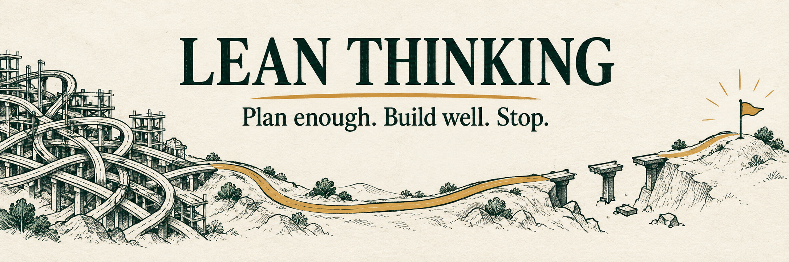

# lean-thinking

Lean Thinking is a small skill for AI coding agents that helps them understand the real task, make one sufficient plan, implement the smallest complete solution, and stop after the result is verified.

It is useful when an agent tends to overplan, rebuild working systems, add speculative layers, or declare victory before necessary checks pass. It keeps explicit requirements and approval boundaries intact. Simple tasks stay simple; risky work still gets the evidence, error handling, and testing it needs.

## Install

Clone this repository, then copy the skill folder into your project:

```sh
git clone https://github.com/Cjbuilds/lean-thinking.git
```

Replace `/path/to/lean-thinking` below with the clone location. Review an existing installed copy before replacing it.

For Codex:

```sh
mkdir -p .agents/skills
cp -R /path/to/lean-thinking/skills/lean-thinking .agents/skills/
```

For Claude Code:

```sh
mkdir -p .claude/skills
cp -R /path/to/lean-thinking/skills/lean-thinking .claude/skills/
```

## Use

Invoke it by name in a request:

```text
Use $lean-thinking to add CSV export to this report page.
```

The skill asks the agent to inspect the relevant evidence, preserve your constraints, choose one small implementation path, run checks that match the risk, and stop when the requested result is proven.

## Check the package

The checker uses only the Python standard library:

```sh
python3 scripts/check.py
```

It validates the skill metadata and package structure, required installation instructions, and local README links.

## Files

```text
lean-thinking/
├── assets/
│   └── banner.png
├── eval/
│   └── RESULTS.md
├── scripts/
│   └── check.py
├── skills/
│   └── lean-thinking/
│       └── SKILL.md
├── LICENSE
└── README.md
```

## Behavioral evaluation

Tested on three matched tasks with Fable 5.1 and GPT-6 Astra, with and without the skill. See the [evaluation method, results, and limits](eval/RESULTS.md). The evaluation is bounded evidence from its documented cases, models, and conditions; it does not prove general improvement or guarantee a correct result.

## Limits

This skill cannot recover missing evidence, grant permissions, or make risky changes safe. Its result still depends on the agent's tools, available context, and judgment. It does not promise to control private reasoning or reduce token use.

## License

[MIT](LICENSE). Use it, adapt it, and share it.
